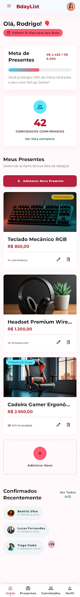
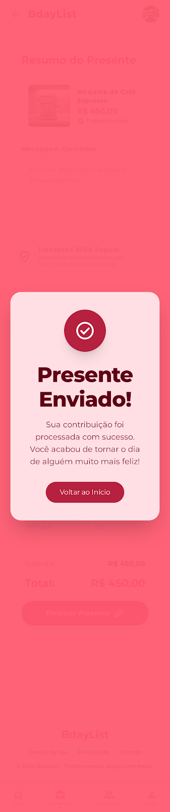

<div align="center">

# 🎉 BdayList

**Português** · [English](README.en.md)

### Sua lista de presentes de aniversário — crie, compartilhe o link e deixe os convidados reservarem o presente.

_Estilo casar.com, mas para aniversários. O aniversariante monta a lista; os convidados confirmam presença e **reservam** o que vão dar — sem presente duplicado, sem stress._

<br/>

[](https://nextjs.org/)
[](https://react.dev/)
[](https://www.typescriptlang.org/)
[](https://tailwindcss.com/)
[](https://tanstack.com/query)
[](https://react-hook-form.com/)
[](https://zod.dev/)
[](docs/backend/README.md)

[](https://github.com/emersonjds/bdaylist/actions/workflows/ci.yml)
[](https://codecov.io/gh/emersonjds/bdaylist)

<!-- Netlify: troque SEU-SITE-ID pelo Site ID em Netlify → Site settings → General → Site information -->

[](https://app.netlify.com/sites/bdaylist/deploys)

[](https://vitest.dev/)
[](https://playwright.dev/)
[](https://mswjs.io/)
[](https://pnpm.io/)
[](#-licença)

</div>

---

## 📸 As telas

<div align="center">

|                                                                         Landing                                                                         |                                                      Painel do aniversariante                                                       |
| :-----------------------------------------------------------------------------------------------------------------------------------------------------: | :---------------------------------------------------------------------------------------------------------------------------------: |
|                          [](design/01-landing-page.png)                          | [](design/03-painel-aniversariante.png) |
|                                                               **Lista (visão convidado)**                                                               |                                                       **Finalizar presente**                                                        |
| [](design/04-lista-presentes-convidado.png) |       [](design/05-finalizar-presente.png)       |

<sub>Telas de referência do design (Stitch). Evidências reais dos fluxos em <a href="e2e/">e2e/&lt;feature&gt;/evidence/\*.png</a>, geradas pelos testes Playwright (mobile 375px + desktop 1280px).</sub>

</div>

---

## ✨ Sobre o produto

O **BdayList** é uma plataforma de **lista de presentes de aniversário**. O aniversariante (host) cria o evento, monta a lista e compartilha um link de alta entropia; os convidados acessam, confirmam presença (RSVP) e **reservam** o presente que vão dar.

> 💡 **Importante:** por enquanto **não há dinheiro passando pelo app**. "Presentear" = **reservar**. O presente é combinado e entregue fora da plataforma. Metas/"% arrecadado" são direção futura (provável PIX externo), fora do escopo atual.

### Quem faz o quê

| 🎂 Aniversariante (host)                                             | 🎁 Convidado                      |
| -------------------------------------------------------------------- | --------------------------------- |
| Cria evento + lista e compartilha o link                             | Acessa pelo link compartilhável   |
| Adiciona/edita presentes (imagem, preço de referência, link da loja) | Confirma presença (RSVP)          |
| Marca "Mais Desejado" e "Presente em Grupo"                          | Reserva o presente (sem duplicar) |
| Acompanha convidados confirmados e atividade                         | Deixa um recado no mural          |
| Opção **"surpresa"**: não ver quem reservou                          | Filtra por preço e busca          |

---

## 🧱 Stack

| Camada                      | Tecnologia                                                                                      |
| --------------------------- | ----------------------------------------------------------------------------------------------- |
| **Framework**               | Next.js 16 (App Router) · **static export** (`output: "export"`)                                |
| **UI**                      | React 19 · TypeScript · Tailwind CSS 4 · `class-variance-authority` · `lucide-react` · `sonner` |
| **Estado & dados**          | TanStack Query 5                                                                                |
| **Formulários & validação** | React Hook Form 7 · Zod 4                                                                       |
| **Mock de API**             | MSW (apenas em dev/testes)                                                                      |
| **Backend (planejado)**     | Supabase — Postgres + RLS + Edge Functions (ver [`docs/backend/`](docs/backend/README.md))      |
| **Testes**                  | Vitest · Testing Library · Playwright                                                           |
| **Tooling**                 | pnpm 10 · ESLint 9 · Prettier 3 (+ plugin Tailwind)                                             |
| **Deploy**                  | Netlify (publish `out/`)                                                                        |

---

## 📐 Arquitetura — Feature-Sliced Design

```
src/
├── app/        ← Rotas e layouts (App Router). Sem regra de negócio.
├── widgets/    ← UI composta (header, gift-grid, dashboard, landing…)
├── features/   ← Casos de uso (reserve-gift, rsvp, manage-gifts, auth…)
├── entities/   ← Modelos de domínio (event, gift, reservation, guest…)
└── shared/     ← Infra reutilizável (ui, lib, providers)
```

**Regra de import:** só de **camadas abaixo** — `app → widgets → features → entities → shared`. Nunca o contrário, nunca lateral entre slices da mesma camada.

---

## 🎨 Identidade visual — _Vibrant Celebration_

| Token                       | Cor                                      |
| --------------------------- | ---------------------------------------- |
| Primária (coral)            | `#FF5A70` · CTA profundo `#b5213e`       |
| Secundária (turquesa)       | `#26C6DA`                                |
| Terciária (amarelo festivo) | `#FFD54F`                                |
| Surface                     | branco sobre `#FFF9FB` · texto `#161d1f` |

**Tipografia:** Montserrat. **Formas:** botões pílula (`rounded-full`), cards `rounded-lg`. Mobile-first, light mode. Fonte de verdade do design: [`design/`](design/).

---

## 🚀 Começando

**Pré-requisitos:** Node.js 20+ e pnpm 10.

```bash
# 1. Instale as dependências
pnpm install

# 2. Configure o ambiente (MSW ligado enquanto o Supabase não existe)
cp .env.local.example .env.local

# 3. Rode em desenvolvimento
pnpm dev          # http://localhost:3000

# 4. Build estático de produção
pnpm build        # gera ./out
```

`.env.local`:

```ini
NEXT_PUBLIC_API_MOCKING=enabled        # liga o MSW no browser
NEXT_PUBLIC_SUPABASE_URL=              # futuro
NEXT_PUBLIC_SUPABASE_PUBLISHABLE_KEY=  # futuro (chave pública; proteção é a RLS)
```

---

## 🧪 Qualidade & testes

Cada feature carrega **três camadas** de teste — e o E2E vale mais que os mocks:

1. **Unitário** — lógica pura (libs, derivações, regras).
2. **Integração (MSW)** — fetchers/queries contra o backend mockado.
3. **E2E (Playwright)** — fluxo real no browser, mobile (375px) e desktop (1280px), com prints de evidência.

```bash
pnpm test            # Vitest em watch
pnpm test:run        # Vitest uma vez
pnpm test:coverage   # cobertura (v8)
pnpm test:e2e        # Playwright (mobile + desktop)
pnpm validate        # type-check + lint + format:check + testes
```

**Snapshot atual:** ✅ **44 testes** passando · **23 arquivos**

| Métrica    | Cobertura  |
| ---------- | ---------- |
| Statements | **81.74%** |
| Lines      | **83.33%** |
| Functions  | **84.21%** |
| Branches   | **70.71%** |

> O **CI** (GitHub Actions) roda `type-check → lint → format:check → test:coverage` a cada push/PR na `main` e envia o `lcov` para o Codecov — as badges de **CI** e **codecov** no topo refletem o estado ao vivo. A tabela acima é um snapshot; rode `pnpm test:coverage` para o valor local.

---

## 📦 Scripts

| Script                                              | O que faz                                  |
| --------------------------------------------------- | ------------------------------------------ |
| `pnpm dev`                                          | Servidor de desenvolvimento                |
| `pnpm build`                                        | Build estático (`out/`)                    |
| `pnpm lint` / `lint:fix`                            | ESLint                                     |
| `pnpm format` / `format:check`                      | Prettier (+ ordenação de classes Tailwind) |
| `pnpm type-check`                                   | `tsc --noEmit`                             |
| `pnpm test` · `test:run` · `test:coverage`          | Vitest                                     |
| `pnpm test:e2e` · `test:e2e:ui` · `test:e2e:report` | Playwright                                 |
| `pnpm validate`                                     | Quality gate completo                      |

---

## 🗂️ Estrutura

```
.
├── src/                  # código da aplicação (FSD)
├── e2e/                  # testes Playwright + evidências (PNG)
├── design/               # design system + telas (fonte de verdade visual)
├── docs/backend/         # ADRs, specs e PDFs do backend (Supabase)
├── public/               # estáticos + worker do MSW
└── out/                  # build estático (gerado)
```

---

## 🔐 Backend & decisões de arquitetura

A plataforma de backend foi decidida via ADRs (Supabase Postgres + RLS + Edge Functions, região São Paulo), com o motor de reserva **atômico, idempotente e anti-TOCTOU** especificado em detalhe. Tudo em [`docs/backend/`](docs/backend/README.md) — inclusive em PDF.

---

## 🤝 Contribuição

- **Micro-commits atômicos**, mensagens em inglês, imperativo curto (`add X`, `fix Y`).
- **100% dos textos de UI em PT-BR.**
- Antes de abrir PR: `pnpm validate` verde, responsivo (375/768/1280) e fiel ao `design/`.

---

## 📄 Licença

MIT.

<div align="center"><sub>Feito com 🎈 para deixar todo aniversário mais fácil de organizar.</sub></div>
